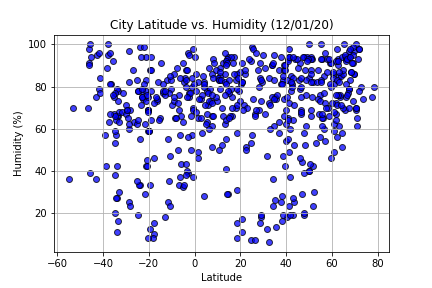
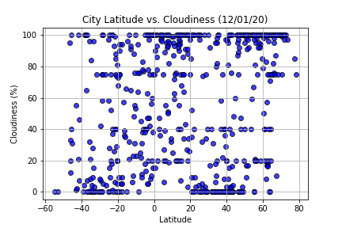
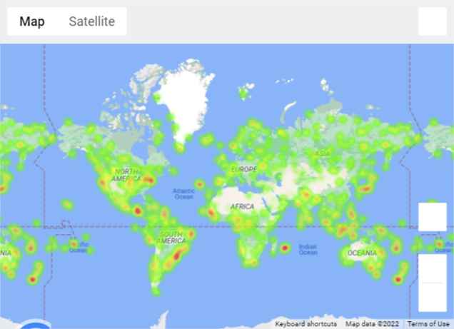

# Today's best weather

# Background
Let's asnwer the question "What's the weather like as we approach the equator?"

Now, we know what you may be thinking: "Duh. It gets hotter..."

But, if pressed, how would you prove it?

# Part I - WeatherPy

A Python script was created to visualize the weather of 500+ cities across the world of varying distance from the equator. To accomplish this, [simple Python library](https://pypi.python.org/pypi/citipy) and [OpenWeatherMap API](https://openweathermap.org/api) were used.

To see the Python script, check jupyter notebook [here](https://github.com/mmparvez/python-api-challenge/blob/main/WeatherPy/WeatherPy.ipynb)

## Observation

- Southern Hemisphere climates tend to be slightly milder than those at similar latitudes in the Northern Hemisphere. This is because the Southern Hemisphere has significantly more ocean and much less land; water heats up and cools down more slowly than land.

- "Highest temperature is found at 0 latitude and as the latidude increases or decreases, temperature drops. This happens as equatorial region receives sunlight straight with less or no angle due to curvature shape of earth.\n",

- "Latitude doesn't have a strong iinfluence on wind speed. The speed of the wind is controlled by the strength of the air pressure gradient, the stronger the pressure gradient the higher the wind speed. "

## Objectives

My first objective is to build a series of scatter plots to showcase the following relationships:

- Temperature (F) vs. Latitude

  

  Highest temperature is found at 0 latitude and as the latidude increases or decreases, temperature drops.

- Humidity (%) vs. Latitude

  

Polar regions have lower humidity and as latitude gets higher,humidity gets higher in southern hemisphere.

- Cloudiness (%) vs. Latitude

  

Cloudiness data is widely spread across the latitude.

- Wind Speed (mph) vs. Latitude

  

  Wind speed data is widely spread across the latitude.

My second objective is to run linear regression on each relationship, only this time separating them into Northern Hemisphere (greater than or equal to 0 degrees latitude) and Southern Hemisphere (less than 0 degrees latitude):

- Northern Hemisphere - Temperature (F) vs. Latitude

  

The r-squared is : -0.83
There is a strong negative correlation between latitude and max temperature for northern hemisphere.

- Southern Hemisphere - Temperature (F) vs. Latitude

  

The r-squared is : 0.46
There is a moderate positive correlation between latitude and max temperature for southern hemisphere.

- Northern Hemisphere - Humidity (%) vs. Latitude

  %20vs.%20Latitude%20Linear%20Regression.png>)

The r-squared is : 0.47
There is a moderate positive correlation between latitude and humidity for northern hemisphere.

- Southern Hemisphere - Humidity (%) vs. Latitude

  %20vs.%20Latitude%20Linear%20Regression.png>)

The r-squared is : 0.29
There is a moderate positive correlation between latitude and humidity for southern hemisphere.

- Northern Hemisphere - Cloudiness (%) vs. Latitude

  %20vs.%20Latitude%20Linear%20Regression.png>)

The r-squared is : 0.23
There is a weak positive correlation between latitude and cloudiness for northern hemisphere.

- Southern Hemisphere - Cloudiness (%) vs. Latitude

  %20vs.%20Latitude%20Linear%20Regression.png>)

The r-squared is : 0.08
There is a weak positive correlation between latitude and cloudiness for southern hemisphere.

- Northern Hemisphere - Wind Speed (mph) vs. Latitude

  %20vs.%20Latitude%20Linear%20Regression.png)

The r-squared is : 0.1
There is a weak positive correlation between latitude and windspeed for northern hemisphere.

- Southern Hemisphere - Wind Speed (mph) vs. Latitude

  %20vs.%20Latitude%20Linear%20Regression.png)

The r-squared is : -0.24
There is a weak negative correlation between latitude and wind speed for southern hemisphere.

The final notebook have:

- 500 unique (non-repeat) cities based on latitude and longitude.
- A weather check was performed on each of the cities using a series of successive API calls.
- A print log was included of each city as it's being processed with the city number and city name.
- Saved a CSV of all retrieved data and a PNG image for each scatter plot.

# Part II - VacationPy

Planing future vacations using jupyter-gmaps and the Google Places API.
Considered 500 cities to find best weather for the vacation.

  

- A heat map was created that displays the humidity for every city from the part I of the project.

  

- Narrowed down the DataFrame to find my ideal weather condition. For example:

  - A max temperature lower than 80 degrees but higher than 70.
  - Wind speed less than 10 mph.
  - Zero cloudiness.
  - Dropped any rows that don't contain all three conditions.

  

  ## To run the code:

  - Install citypy in your python environment (https://pypi.python.org/pypi/citipy)
  - Save OpenWeatherMap API Key (https://openweathermap.org/) as 'weather_api_key'
  - Google API Key (https://console.developers.google.com/getting-started) as 'g_key'
  - Create API Keys and store it in the 'api_keys.py' file before running the Jupyter notebooks.
